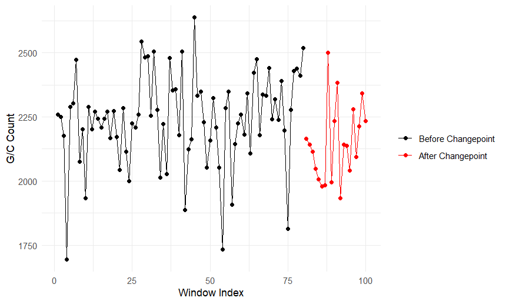
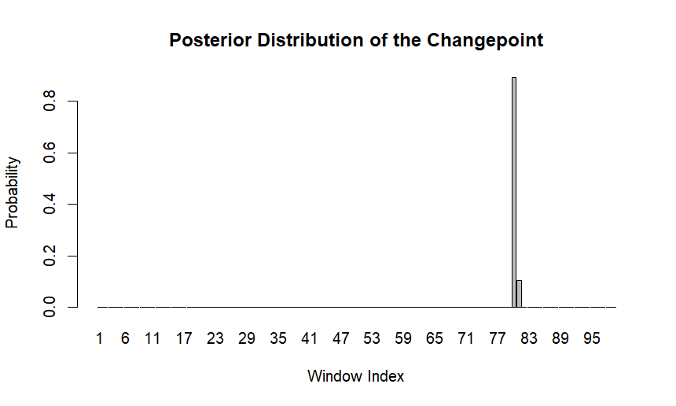
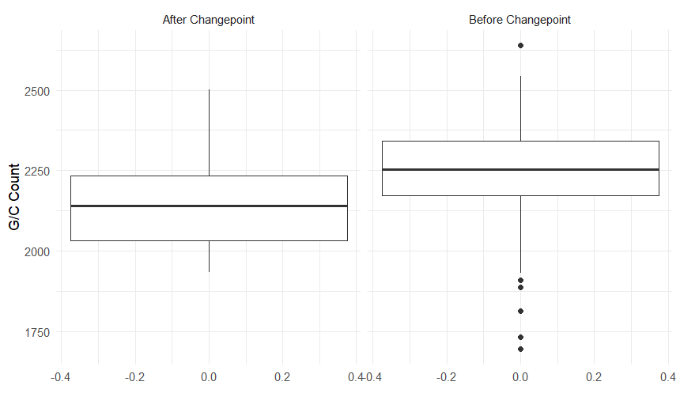
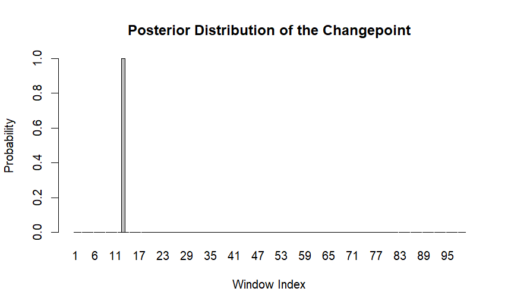
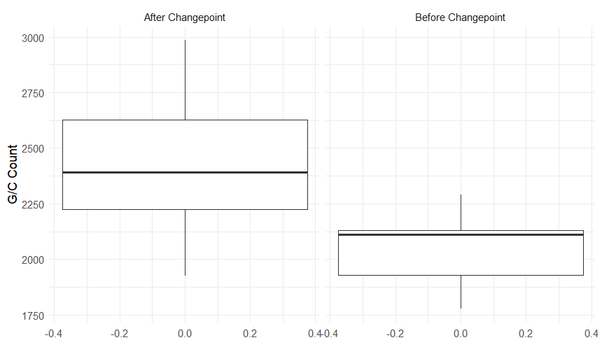
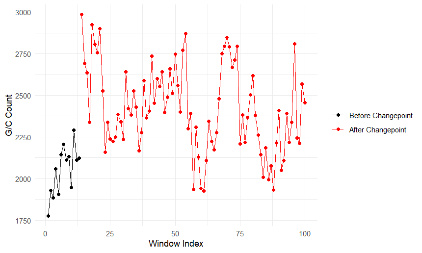
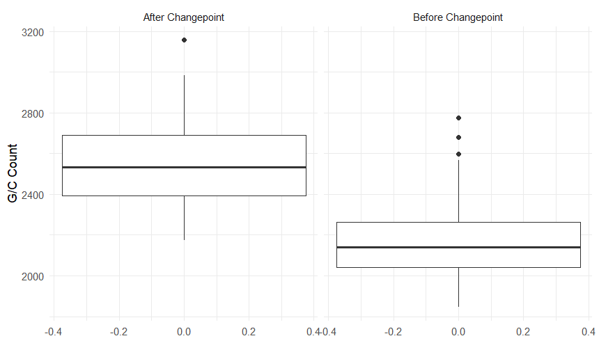
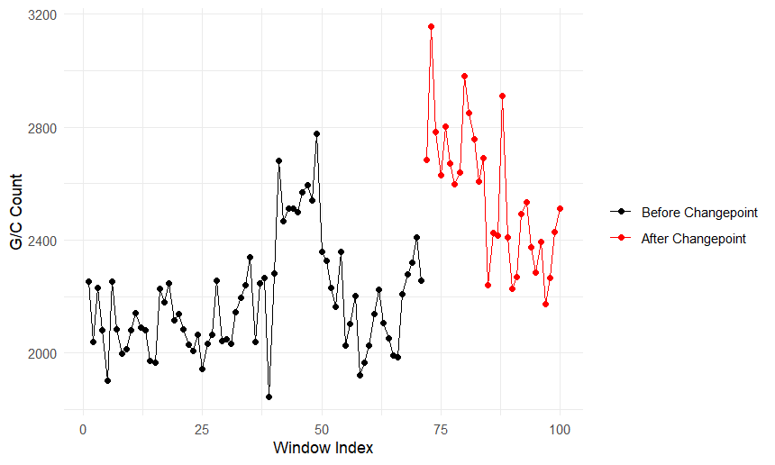
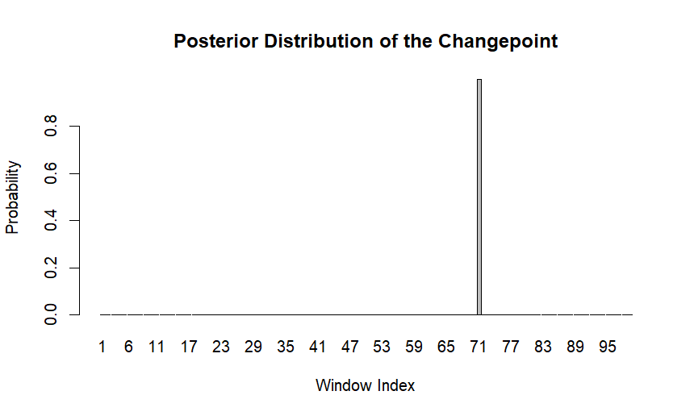

# Bayesian Change-Point Detection in Genomic GC-Content Using R

This repository contains an academic project completed as part of the course **Bayesian Statistics**.

## 🧬 Overview

An organism’s genetic information is encoded in DNA molecules organized into chromosomes. DNA sequences consist of four nucleotide bases: adenine (A), guanine (G), cytosine (C), and thymine (T).

GC-content refers to the proportion of nucleotides in a DNA sequence that are either guanine (G) or cytosine (C).

Isochores are regions of a chromosome in which GC-content is approximately constant.

The `data` folder contains 5 datasets, each consisting of 100 consecutive observations of G/C counts across genomic windows of length 5000.

The goal is to determine whether each dataset originates from:
- a single homogeneous isochore, or  
- two distinct isochores separated by a structural change in GC-content.

---

## 🗂️ Datasets

Each dataset consists of a sequence $x = (x_1, x_2, \dots, x_n)$, where each observation $x_i$ represents the number of G or C bases within a genomic window of length $m = 5000$ bases, over $n = 100$ consecutive windows.

The observations are sequential and correspond to consecutive genomic windows along a DNA segment.

---

## 📃 Methodology

### Statistical Modeling

We assume that nucleotides behave independently and that the probability of observing a G or C base remains constant within a given genomic region.

Thus, each observation follows a Binomial model:

$$
x_i \mid \theta \sim \text{Binomial}(m, \theta), \quad i = 1,2,\dots,n
$$

where:
- $m = 5000$
- $\theta$ is the probability that a randomly selected nucleotide within the window is either G or C.

### Competing Models

#### Model $M_1$: Single Isochore

The entire sequence originates from one homogeneous region:

$$
x_i \sim \text{Binomial}(m, \theta), \quad \forall i = 1,\dots,n
$$

#### Model $M_2$: Two Isochores (Change-Point Model)

There exists an unknown change point $t \in \\{1,2,\dots,n-1\\}$ such that:

$$
x_i \sim \text{Binomial}(m, \theta_1), \quad i = 1,\dots,t
$$

$$
x_i \sim \text{Binomial}(m, \theta_2), \quad i = t+1,\dots,n
$$

This represents a structural shift in GC-content along the sequence.

### Bayesian Inference

To compare the two competing models, we use Bayesian model comparison.

- Model priors:

$$
P(M_1) = P(M_2) = \frac{1}{2}
$$

- Parameter priors:

$$
\theta, \theta_1, \theta_2 \sim \mathcal{U}(0,1) = \text{Beta}(1,1)
$$

- Change-point prior:

$$
t \sim \mathcal{U}\\{1,2,\dots,n-1\\}
$$

Marginal likelihoods are computed analytically using Beta–Binomial conjugacy.

### Objective

For each dataset, we compute and compare the posterior probabilities of:
- $M_1$: single-isochore model  
- $M_2$: two-isochore change-point model  

to determine whether a structural change in GC-content is supported by the data.

---

## 📈 Results

For all datasets, the posterior probability strongly favors the two-isochore model. The posterior mass concentrates almost entirely on $M_2$, indicating strong evidence of structural changes in GC-content along the sequences.

### 1st Dataset



Based on the posterior distribution, the most probable change point occurs at the 80th window.



From the 81st window onward (highlighted in red), GC-content fluctuates around lower values. This pattern is also reflected in the corresponding boxplot shown below.



### 2nd Dataset


The dataset exhibits a sharp and persistent decrease in GC-content beyond a specific point, supporting the hypothesis of two distinct isochores. The most probable change point occurs at the 37th window.



The boxplot below illustrates the distribution of GC-content values per window for each isochore, highlighting the difference between the two regions.



### 3rd Dataset



The third dataset appears to contain an initial region in which GC-content fluctuates around lower values, while the subsequent region exhibits a noticeable increase in GC-content.

The most probable change point occurs at the 13th window.


The corresponding boxplot further illustrates the difference between the two inferred regions.


### 4th Dataset


In this dataset, the initial windows appear to belong to a region characterized by increased GC-content, whereas the subsequent region exhibits substantially lower values.

The most probable change point occurs at the 16th window.


The boxplot below highlights the contrast between the two inferred regions.



### 5th Dataset



In the fifth dataset, the final windows appear to belong to a different genomic region. More specifically, from the 72nd window onward, a sharp increase in GC-content is observed.

The most probable change point occurs at the 71st window.



The boxplot below illustrates the difference between the two inferred regions.


---

## ⚙️ Tools and Technologies Used

- R  
- RStudio  
- ggplot2  

---

## ▶️ How to Run

1. Clone or download this repository.

2. Open `Isochores.Rproj` in RStudio.

3. Install the required package:

```r
install.packages("ggplot2")
```
4. Run the script:

```r
source("isochore_changepoint_analysis.R") 
```

---

## ✍️ Notes

- This README also serves as a concise project report.

--- 

## 👨‍💻 Author

**Marios Giannakopoulos**

Department of Mathematics  

National and Kapodistrian University of Athens


