# 🧬 Bayesian Model Comparison for Isochore Detection (R)
This repository contains an academic project completed as part of the course **Bayesian Statistics**.
## 📖 Overview
An organism’s genetic information is encoded in its cells in DNA molecules, organized into structures called chromosomes. DNA molecules are polymers that consist of a long chain of monomers, which are called nucleotides. Each nucleotide contains a nitrogenous base. There are four types of bases: adenine (A), guanine (G), cytosine (C), and thymine (T).

Isochores are regions (segments of the chain) of a specific chromosome in which the percentage of bases of type C or G is approximately constant.

The data folder contains 5 datasets, each consisting of 100 consecutive observations concerning the number of bases of type C or G in windows composed of 5000 bases each. 

The goal is to determine whether each dataset originates from one or two different isochores. 

## 🗂️ Datasets
Each dataset is a sequence $x = (x_i)_{i=1}^n$ of $n = 100$ observations, where each observation $x_i$ represents the number of nucleotides of type **C or G** within a window of length $m = 5000$ bases.

The observations are sequential and correspond to consecutive genomic windows along a DNA segment.

## 📃 Methodology
The goal is to determine whether each dataset originates from:

- a **single isochore (homogeneous genomic region)**, or  
- **two different isochores (a structural change in CG-content)**.

### Statistical Modeling

We assume that each base behaves independently, and that the probability of observing a C or G base is constant within a given region.

Thus, each observation follows a Binomial model:

$$
x_i \mid \theta \sim \text{Binomial}(m, \theta), \quad i = 1,2,\dots,n
$$

where:
- $m = 5000$
- $\theta$ is the probability of observing a C or G base inside the window.

### Competing Models

- Model $M_1$: Single Isochore

The entire sequence comes from one homogeneous region:

$$
x_i \sim \text{Binomial}(m, \theta), \quad \forall i = 1,\dots,n
$$

- Model $M_2$: Two Isochores (Change-Point Model)

There exists an unknown change point $t \in \\{1,2,\dots,n-1\\}$ such that:

$$
x_i \sim \text{Binomial}(m, \theta_1), \quad i = 1,\dots,t
$$

$$
x_i \sim \text{Binomial}(m, \theta_2), \quad i = t+1,\dots,n
$$

This represents a structural shift in CG-content along the sequence.

### Bayesian Framework

To compare the two models, we use the Bayesian approach.

- Model probabilities:
$$P(M_1) = P(M_2) = \frac{1}{2}$$

- Parameter priors:
$$\theta \sim \mathcal{U}(0,1), \quad
\theta_1 \sim \mathcal{U}(0,1), \quad
\theta_2 \sim \mathcal{U}(0,1)$$

- Change-point prior:
$$t \sim \mathcal{U}\\{1,2,\dots,n-1\\}$$

### Objective

For each dataset, we compute and compare the posterior probabilities of:

- $M_1$: single isochore model  
- $M_2$: two-isochore change-point model  

to determine whether a structural change in CG-content is supported by the data.

## 📈 Results
For every single dataset we obtain $P(M_2 \mid x) = 1$ and $P(M_1 \mid x) = 0$. Thus, it is almost certain that every single dataset originates from two different isochores.

### 1st Dataset

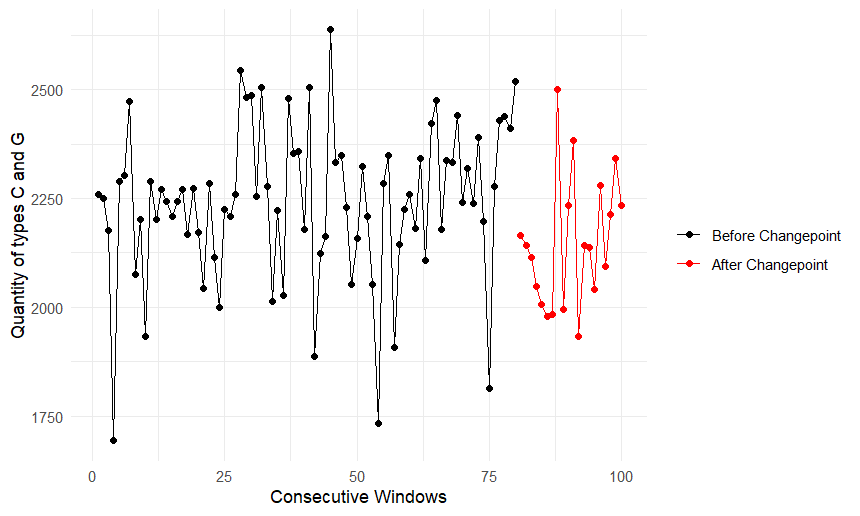

Based on the posterior distribution, the most probable structural change point occurs at the 80th window.

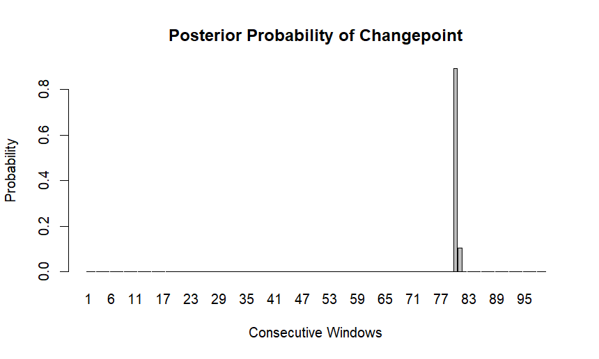

From the 81st window onward (highlighted in red), the CG-content per window fluctuates around lower values. This pattern is also reflected in the corresponding boxplot shown below.

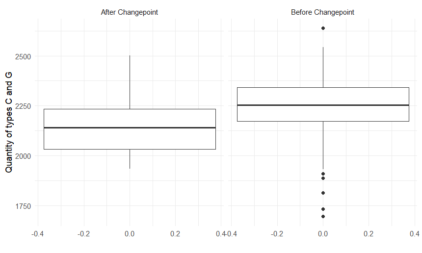

### 2nd Dataset

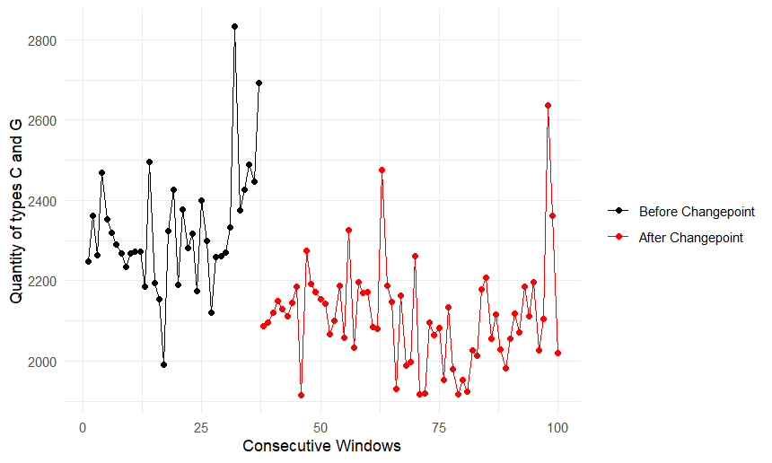

At first glance, the dataset exhibits a sharp and persistent decrease in CG-content per window beyond a certain point, supporting the hypothesis that the sequence originates from two distinct isochores. The most probable structural change point occurs at the 37th window.

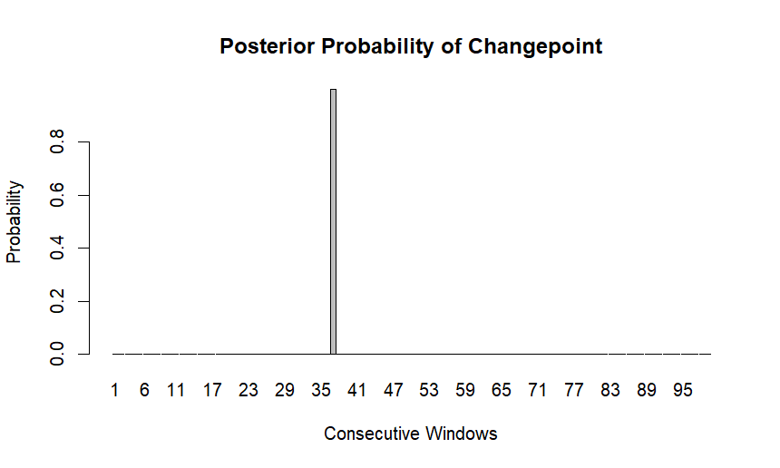

The boxplot below illustrates the distribution of CG-content values per window for each isochore, highlighting the difference between the two regions.

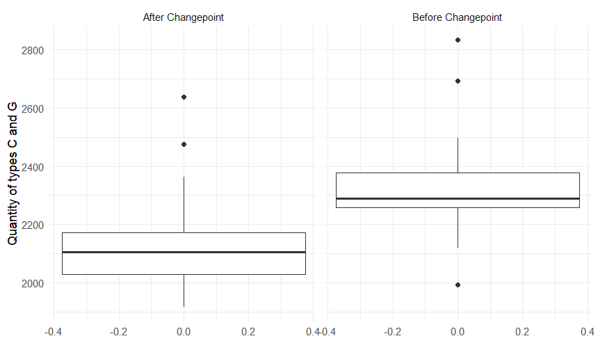

### 3rd Dataset

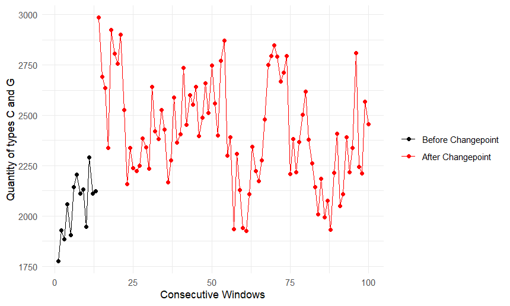

The third dataset appears to contain an initial segment belonging to an isochore in which the C/G content per window fluctuates around lower values, while the subsequent isochore exhibits a noticeable increase in the corresponding content.

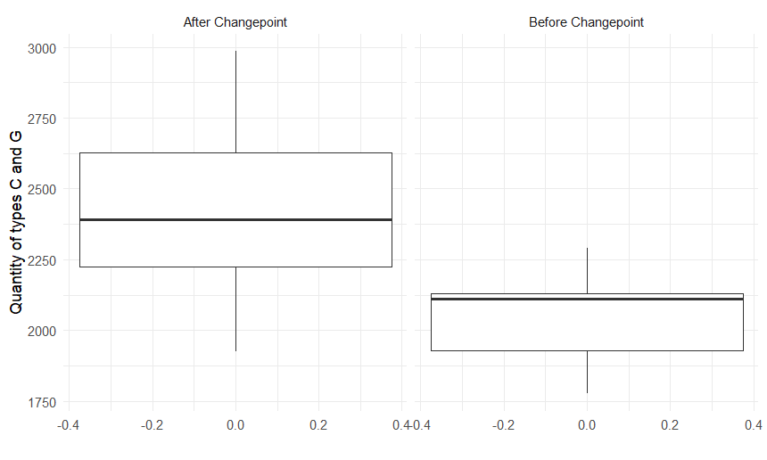

In this case, the structural change occurs relatively early in the sequence. The most probable structural change point is the 13th window.

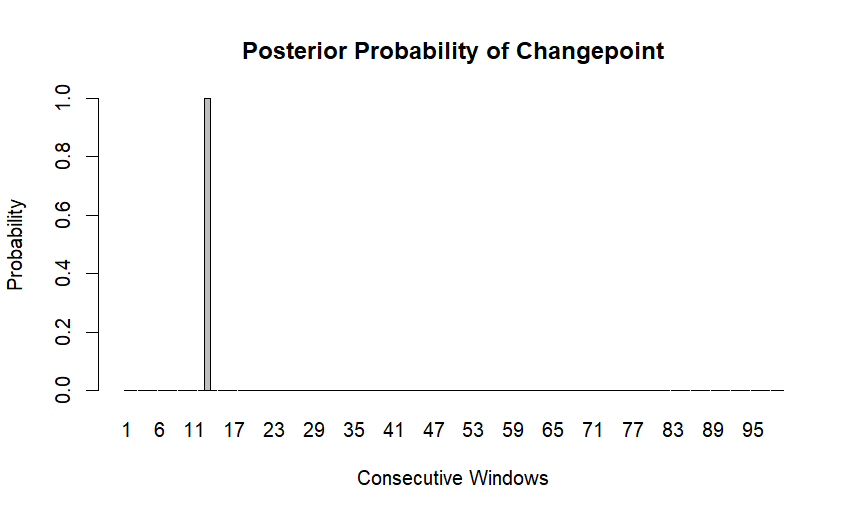

### 4th Dataset

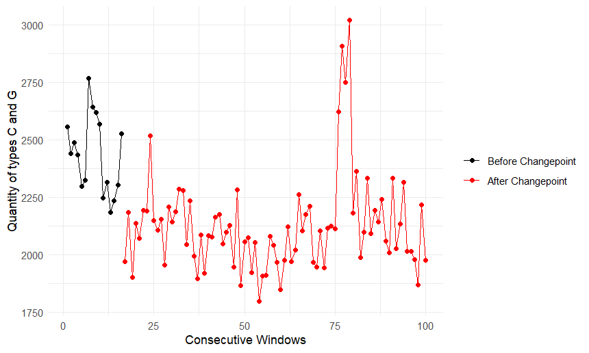

In this dataset, the initial windows appear to belong to an isochore characterized by an increased proportion of C and G bases, whereas the subsequent isochore exhibits a substantially lower proportion.

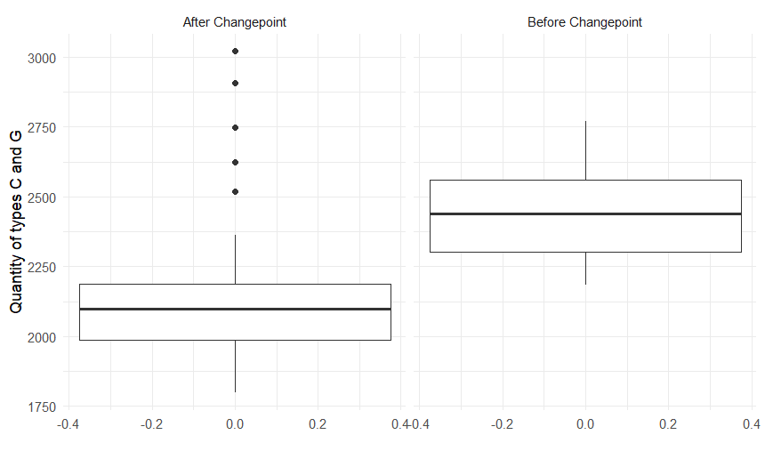

The most probable structural change point occurs at the 16th window.

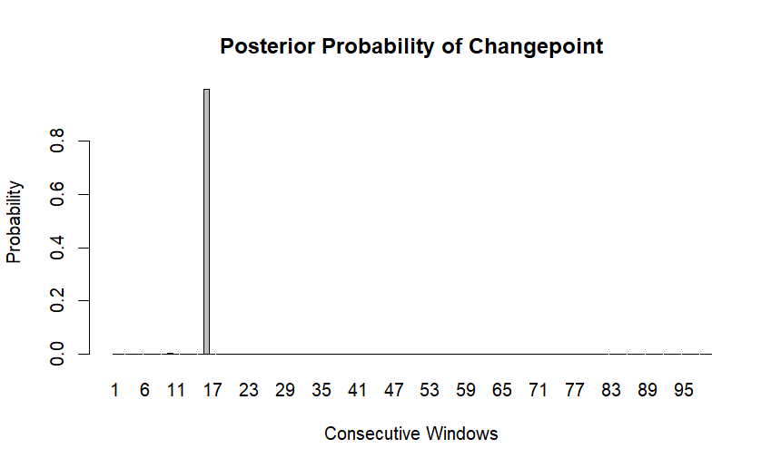

### 5th Dataset

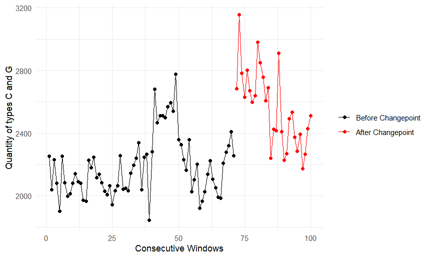

In the fifth dataset, the final windows appear to belong to a different isochore. More specifically, from the 72nd window onward, a sharp increase in the number of C/G bases per window is observed.

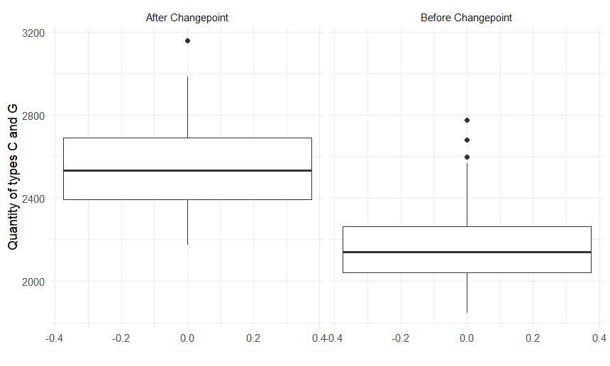

The most probable structural change point occurs at the 71st window.

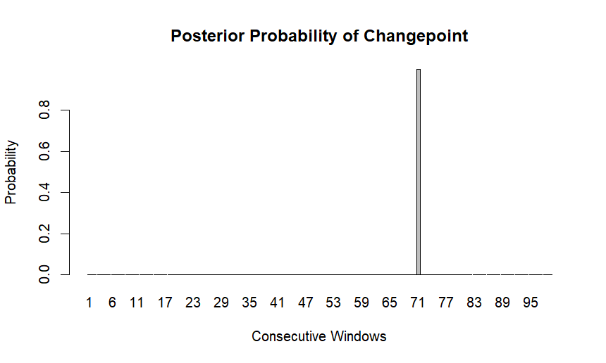
## ▶️ How to Run

1. Clone or download this repository.

2. Open `Isochores.Rproj` in RStudio.

3. Install the required package:

```r
install.packages("ggplot2")
```
4. Run the script:

```r
source("bayesian_model_comparison.R") 
```

## ✍️ Notes

- This README also serves as a concise project report.
- A more detailed report in Greek is available in `report.pdf`.

## 👨‍💻 Author

Marios Giannakopoulos  
Department of Mathematics  
National and Kapodistrian University of Athens


